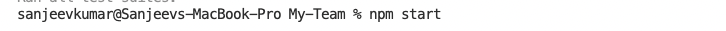
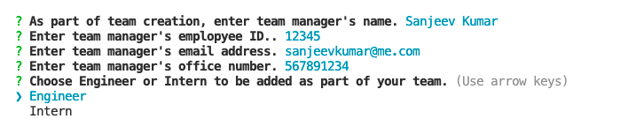

# My Team

[Application URL  ](https://github.com/SanjeevKumar-DEV/My-Team) 

[Repository URL ](https://github.com/SanjeevKumar-DEV/My-Team)

## Description

> This command line application generates HTML 
> content when user provides input for his/her 
> details and all the team members part of 
> his/her team. This generated HTML presents 
> all the team member details and can be 
> accessed using public URL. 

## Table of Contents

- [Installation](#Installation)
- [Usage](#Usage)
- [Contributing](#Contributing)
- [Tests](#Tests)
- [Questions](#Questions)
- [License](#License)

## Installation

Clone the repository using the repository URL as mentioned below.
```
Git clone git@github.com:SanjeevKumar-DEV/My-Team.git
```
Open Terminal and go to cloned repository location and start code editor.
```
Code .
```

## Usage

> Start this command line application by typing command “npm Start” 

 

> Answer the question one after another for manager and all team members. 

 


## Contributing

> Contribution guidelines development is in progress. 

 


## Tests

> Create all your tests and put in tests directory 
> To run the test run the command “npm test” 

## Questions

> Q1. What is my link to my github profile ? 
Answer: [Github Username](https://github.com/SanjeevKumar-DEV) 

> Q2. How to reach me with additional questions ? 
Answer: [Contact Email](mailto:sanjeevkumar@me.com)

## License

> License agreement is covered under guidelines and agreement of GitHub and Microsoft.
